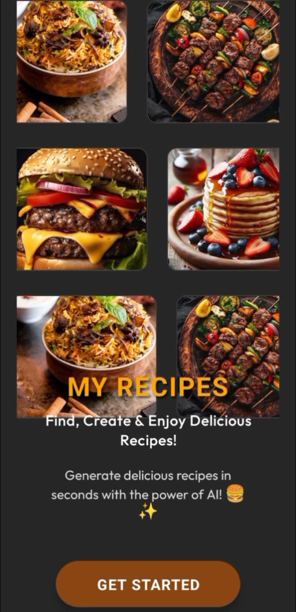
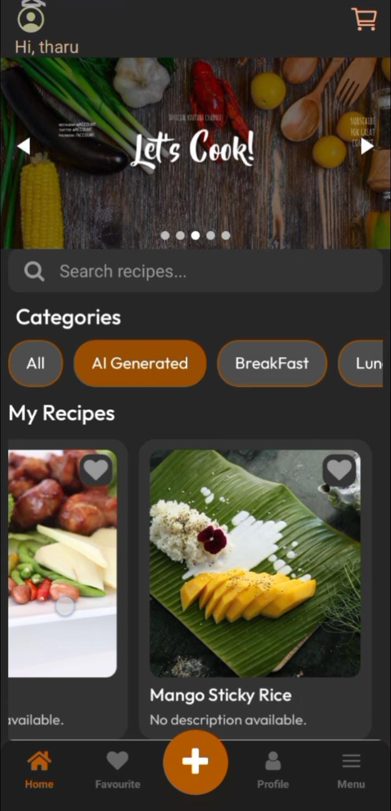
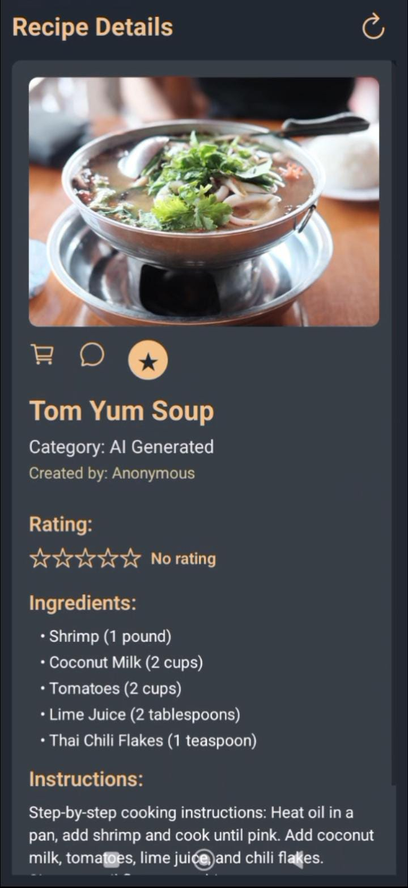

# 🍳 AI Recipe Book 🤖

An intelligent mobile application that helps users discover, create, and manage recipes using AI. Built with modern technologies like React Native, Expo, Firebase, and Node.js.

---

## 🚀 Features

✨ User Authentication

* Sign Up & Login using Firebase Authentication

🍽️ AI Recipe Generator

* Generate recipes based on user preferences (cuisine, ingredients, etc.)
* Smart AI integration using API

📝 Create Your Own Recipes

* Users can add and save their own recipes

💰 Recipe Cost Estimation

* View estimated cost for each recipe

⭐ Reviews & Ratings

* Users can comment and rate recipes

🛒 Shopping Support

* Add ingredients to shopping list/cart

📱 Modern UI

* Clean and responsive mobile design using React Native Expo

---

## 🛠️ Tech Stack

* ⚛️ React Native (Expo)
* 🔥 Firebase (Authentication + Database)
* 🌐 Node.js (Backend/API)
* 🤖 AI API (Recipe Generation)
* 💾 Firestore Database

---

## 📂 Project Structure

app/ → Main application screens (Expo Router)
components/ → Reusable UI components
services/ → API and Firebase services
context/ → Global state management
assets/ → Images and icons
config/ → Configuration files

---

## ⚙️ Installation & Setup

1. Clone the repository

```bash
git clone https://github.com/DiluTharushika/Ai-Recipe-Book.git
```

2. Install dependencies

```bash
npm install
```

3. Start the app

```bash
npx expo start
```

---

## 📸 Screenshots

## 📸 Screenshots

### 🔐 Login Screen


### 🚀 Landing Screen


### 🏠 Home Screen


### 📖 Recipe Detail Screen


---

## 🎯 Future Improvements

* 🔍 Advanced search & filters
* 🧠 Better AI recommendations
* 📊 Nutrition tracking
* 🌍 Multi-language support

---

## 🤝 Contributing

Contributions are welcome! Feel free to fork and improve this project.

---

## 📧 Contact

👩‍💻 Developed by **Dilu Tharushika**
📬 Feel free to reach out for collaborations

---


